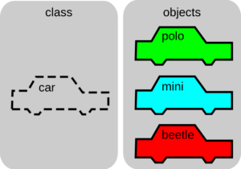
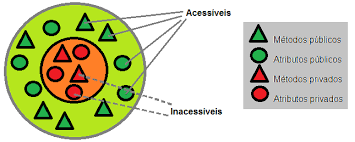

# Learning about classes and objects
## Classes are shapes that create objects
> Classes can be called in 2 ways

> - static where you don't need to give new to use the (dot) but only static items appear as an option
> - object where to access attributes and methods it is necessary to give new to create an object
## Encapsulation
>It can be seen as a bureaucracy in the code, but it makes refactoring much easier with minimal or no impact for those who already consume the objects of this class Examples:

> - changing the name of an attribute that is being accessed directly for the class, requires it to be set too
---

## Classes

---
---
## Encapsulation

---